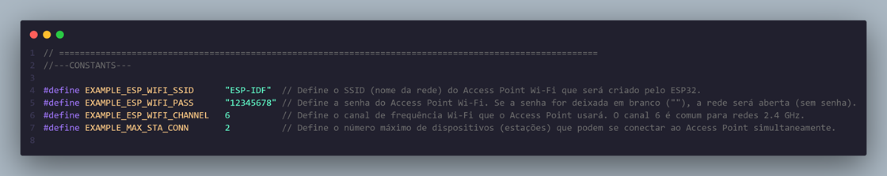

# _Access Point com ESP32_

---

## Sumário

- [Histórico de Versão](#histórico-de-versão)
- [Resumo](#resumo)
- [Objetivo](#objetivo)
- [Links para estudos](#links-para-estudos)
- [Pinos do projeto eletrônico](#pinos-do-projeto-eletrônico)
- [Bibliotecas](#bibliotecas)
- [Configuração do Firmware](#configuração-do-firmware)
- [Informações](#informações)

## Histórico de versão

| Versão | Data       | Autor         | Descrição          |
|--------|------------|---------------|--------------------|
| 1.0.0  | 13/03/2025 | Adenilton R   | Inicio do projeto  |

---

## Resumo

Este projeto tem como objetivo criar um Access Point (AP) Wi-Fi utilizando o ESP32, permitindo que dispositivos se conectem a ele e controlem um LED através de uma interface web. O ESP32 atua como um servidor web, fornecendo uma página HTML que permite ligar e desligar o LED conectado ao pino GPIO.

O projeto utiliza o framework ESP-IDF e inclui funcionalidades como:

- Configuração de um Access Point Wi-Fi.
- Servidor HTTP para servir uma página web.
- Controle de um LED via requisições HTTP.
- Suporte a Captive Portal Detection para dispositivos Android, iOS e Windows.

## Objetivo

O objetivo principal deste projeto é demonstrar como configurar um ESP32 como um Access Point e criar uma interface web simples para controle de hardware. Os objetivos específicos incluem:

1. **Configuração do Access Point**:
    - Configurar o ESP32 para funcionar como um Access Point Wi-Fi com SSID e senha personalizados.
    - Limitar o número máximo de conexões simultâneas.
2. **Servidor HTTP**:
    - Implementar um servidor HTTP que sirva uma página web para controle do LED.
    - Suportar requisições para ligar e desligar o LED.
3. **Captive Portal Detection**:
    - Implementar suporte a Captive Portal Detection para dispositivos Android, iOS e Windows, permitindo que os dispositivos se conectem automaticamente ao Access Point.
4. **Controle de LED**:
    - Controlar um LED conectado ao pino GPIO do ESP32 através de requisições HTTP.

## Links para estudos

[**ESP-IDF Documentation**](https://docs.espressif.com/projects/esp-idf/en/latest/esp32/index.html)

[**ESP32 HTTP Server Example**](https://github.com/espressif/esp-idf/tree/master/examples/protocols/http_server)

[**Captive Portal Detection**](https://en.wikipedia.org/wiki/Captive_portal)

## Pinos do projeto eletrônico

| Nome         | Pino GPIO  |
|--------------|------------|
| LED_GPIO_PIN | GPIO_NUM_2 |

## Bibliotecas

[main.c](https://github.com/AdeniltonR/Firmware-para-IDF-Espressif/blob/main/ESP-IDF/access-point/main/main.c)

[access_point.c](https://github.com/AdeniltonR/Firmware-para-IDF-Espressif/blob/main/ESP-IDF/access-point/components/access_point/access_point.c)

[access_point.h](https://github.com/AdeniltonR/Firmware-para-IDF-Espressif/blob/main/ESP-IDF/access-point/components/access_point/include/access_point.h)

[CMakeLists.txt](https://github.com/AdeniltonR/Firmware-para-IDF-Espressif/blob/main/ESP-IDF/access-point/components/access_point/CMakeLists.txt)

[html.c](https://github.com/AdeniltonR/Firmware-para-IDF-Espressif/blob/main/ESP-IDF/access-point/components/html/html.c)

[html.h](https://github.com/AdeniltonR/Firmware-para-IDF-Espressif/blob/main/ESP-IDF/access-point/components/html/include/html.h)

## Configuração do Firmware

O Access Point é configurado com os seguintes parâmetros no arquivo `access_point.h`:

Página HTML:

## Informações

| Info        | Modelo        |
|-------------|---------------|
| uC          | ESP32 32D     |
| Placa       | ESP32 Module  |
| Arquitetura | Xtensa / RISC |
| IDE         | IDF v5.4.0    |