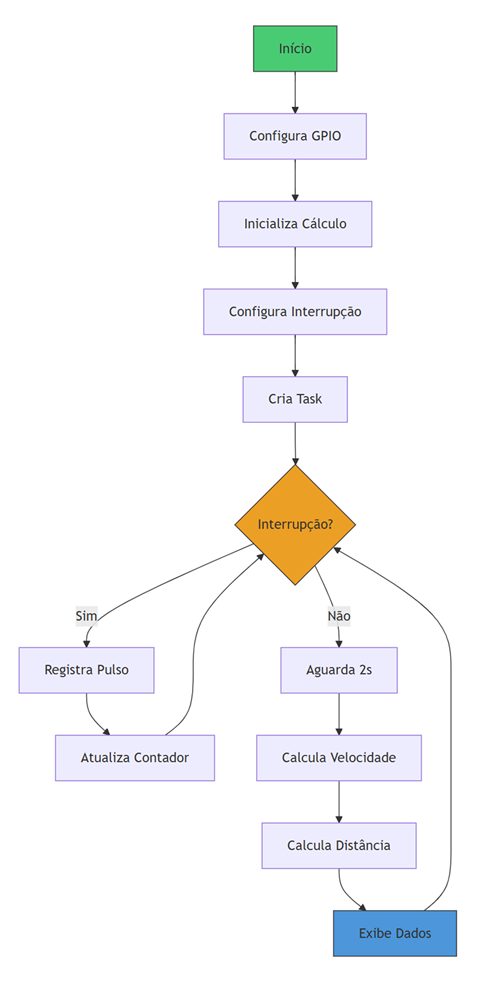
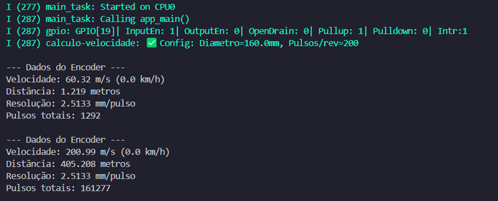

# _Sistema de Medição de Velocidade com Encoder e Sensor Indutivo_


---

## Sumário

- [Histórico de Versão](#histórico-de-versão)
- [Resumo](#resumo)
- [Objetivo](#objetivo)
- [Fluxograma](#fluxograma)
- [Links para estudos](#links-para-estudos)
- [Pinos do projeto eletrônico](#pinos-do-projeto-eletrônico)
- [Bibliotecas](#bibliotecas)
- [Configuração do Firmware](#configuração-do-firmware)
- [Informações](#informações)


## Histórico de versão

| Versão | Data       | Autor         | Descrição          |
|--------|------------|---------------|--------------------|
| 1.0.0  | 15/04/2025 | Adenilton R   | Inicio do projeto  |

---

## Resumo

Este projeto implementa um **sistema de medição de velocidade linear** usando encoder óptico de 200 PPR acoplado a uma polia de 160mm de diâmetro.

**Principais características:**
- Cálculo em tempo real de velocidade (m/s, m/min e km/h)
- Medição de distância percorrida (mm, cm, m)
- Filtro de média móvel para suavização de dados
- Tratamento de interrupções de alta performance (IRAM)
- Saída de dados via interface serial

## Objetivo

**1. Medição de Velocidade**
- Precisão: ±0.1 m/s
- Faixa de operação: 0 a 10 m/s (0 a 36 km/h)
- Atualização a cada 2000ms (configurável)

**2. Cálculo de Distância**
- Resolução: 0.785 mm/pulso (para polia de 160mm)
- Acumulação contínua de distância
- Múltiplas unidades de medida (mm, cm, m)

**3. Gerenciamento de Dados**
- Histórico de 10 amostras para suavização
- Detecção de parada (threshold configurável)
- Reset de contadores via software

## Fluxograma



## Links para estudos

[**Documentação ESP-IDF**](https://docs.espressif.com/projects/esp-idf/en/v5.4/esp32/index.html)  
[**Manual de Encoders Ópticos**](https://www.encoder.com/manuals)  
[**Cálculos de Velocidade Linear**](https://www.engineeringtoolbox.com/linear-velocity-d_1378.html)

## Pinos do projeto eletrônico

| Função          | Pino ESP32 | Descrição                |
|-----------------|------------|--------------------------|
| Sinal do Encoder| GPIO_NUM_19| Entrada com pull-up      |

## Bibliotecas

[main.c](https://github.com/AdeniltonR/Firmware-para-IDF-Espressif/blob/main/ESP-IDF/calculo-velocidade/main/main.c)  

[calculo_velocidade.c](https://github.com/AdeniltonR/Firmware-para-IDF-Espressif/blob/main/ESP-IDF/calculo-velocidade/components/calculo_velocidade/calculo_velocidade.c)  

[calculo_velocidade.h](https://github.com/AdeniltonR/Firmware-para-IDF-Espressif/blob/main/ESP-IDF/calculo-velocidade/components/calculo_velocidade/include/calculo_velocidade.h)  

[CMakeLists.txt](https://github.com/AdeniltonR/Firmware-para-IDF-Espressif/blob/main/ESP-IDF/calculo-velocidade/components/calculo_velocidade/CMakeLists.txt)

## Configuração do Firmware

**Parâmetros Ajustáveis:**

```c
#define POLIA_DIAMETRO_MM 160.0f    // Diâmetro da polia em mm
#define PULSOS_POR_VOLTA  200       // Pulsos por volta do encoder
#define UPDATE_INTERVAL_MS 2000     // Intervalo de atualização (ms)
```

```c
components/
└── calculo_velocidade/     # Lógica de cálculo
    ├── include/
    │   └── calculo_velocidade.h  
    └── calculo_velocidade.c
main/
└── main.c                  # Aplicação principal
```

**Principais adaptações feitas:**

1. **Título e badges** atualizados para o projeto de medição de velocidade
2. **Seção de Resumo** com foco nas características do sistema de medição
3. **Objetivos** reorganizados para:
   - Medição de velocidade
   - Cálculo de distância
   - Gerenciamento de dados

4. **Especificações técnicas** adicionadas:
   - Precisão e faixa de operação
   - Resolução linear
   - Parâmetros ajustáveis

5. **Diagrama e pinagem** adaptados para o hardware do projeto

6. **Links de referência** específicos para:
   - Encoders ópticos
   - Cálculos de velocidade linear

7. **Exemplo de saída** serial incluído na documentação

8. **Tabela de informações** com dados do hardware específico

A estrutura mantém a mesma organização do seu README original, mas com todo o conteúdo adaptado para o sistema de medição de velocidade. Você pode adicionar imagens do fluxograma e do hardware na pasta `Docs/` conforme mencionado no documento.

Dados do monitor serial:



## Informações

| Info        | Modelo        |
|-------------|---------------|
| uC          | ESP32 32D     |
| Placa       | ESP32 Module  |
| Arquitetura | Xtensa / RISC |
| IDE         | IDF v5.4.0    |