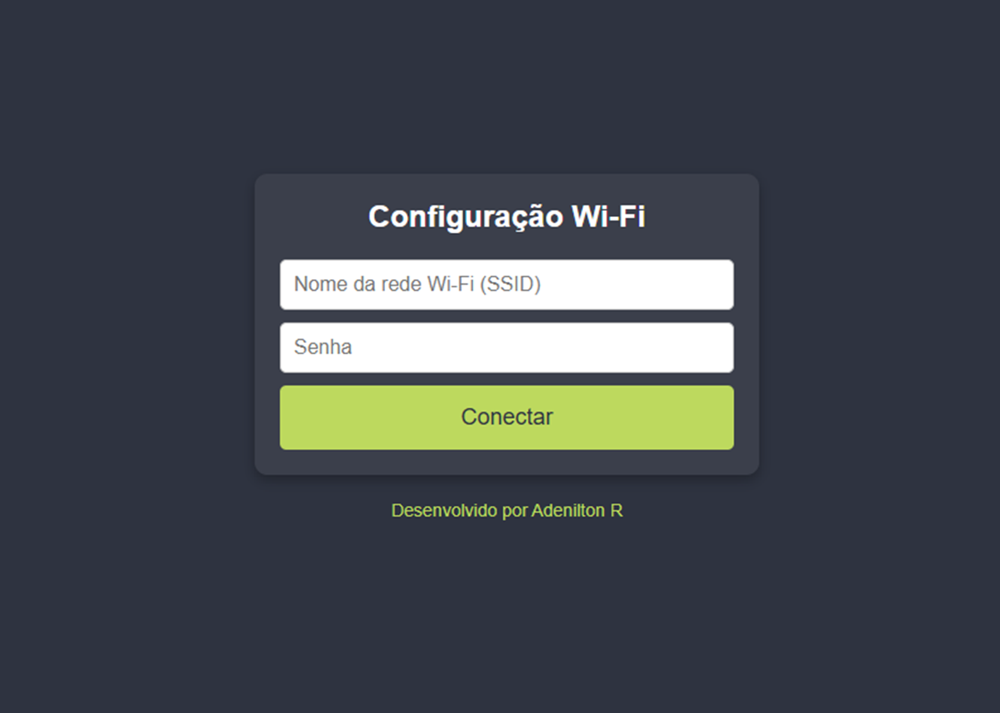
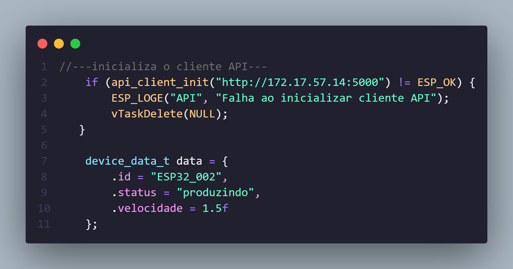
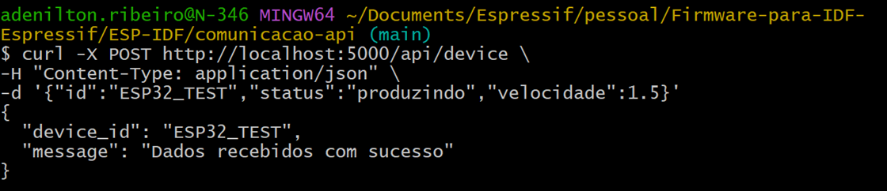

# _Comunicação API_


---

## Sumário

- [Histórico de Versão](#histórico-de-versão)
- [Resumo](#resumo)
- [Objetivo](#objetivo)
- [Fluxograma](#fluxograma)
- [Links para estudos](#links-para-estudos)
- [Pinos do projeto eletrônico](#pinos-do-projeto-eletrônico)
- [Bibliotecas](#bibliotecas)
- [Configuração do Firmware](#configuração-do-firmware)
- [Informações](#informações)


## Histórico de versão

| Versão | Data       | Autor         | Descrição          |
|--------|------------|---------------|--------------------|
| 1.0.0  | 17/04/2025 | Adenilton R   | Inicio do projeto  |

---

## Resumo

Sistema completo para monitoramento remoto de equipamentos industriais, composto por:
- **Firmware ESP32**: Coleta e envia dados de velocidade
- **API Python**: Recebe e armazena dados dos dispositivos
- **Interface REST**: Documentação automática e endpoints para consulta

## Objetivo

**Firmware ESP32**

- Conexão WiFi dual-mode (STA/AP)
- Envio periódico de dados via HTTP
- Controle por botão físico (GPIO0)
- Sistema de logs detalhado

**API Python**

- Endpoints REST para:
  - Recebimento de dados (`POST /api/device`)
  - Consulta de dispositivos (`GET /api/device/<id>`)
  - Documentação interativa (`GET /api/docs`)
- Validação de dados
- Armazenamento em memória

## Links para estudos

[**Documentação ESP-IDF**](https://docs.espressif.com/projects/esp-idf/en/v5.4/esp32/index.html)

[**Exemplos Oficiais Wi-Fi**](https://github.com/espressif/esp-idf/tree/v5.4/examples/wifi)

## Pinos do projeto eletrônico

| Função          | Pino ESP32 |
|-----------------|------------|
| Botão Modo AP   | GPIO_NUM_0 |

## Bibliotecas

[main.c](https://github.com/AdeniltonR/Firmware-para-IDF-Espressif/blob/main/ESP-IDF/wifi-manager/main/main.c)

[Kconfig.projbuild](https://github.com/AdeniltonR/Firmware-para-IDF-Espressif/blob/main/ESP-IDF/wifi-manager/main/Kconfig.projbuild)

[wifi.c](https://github.com/AdeniltonR/Firmware-para-IDF-Espressif/blob/main/ESP-IDF/wifi-manager/components/wifi/wifi.c)

[wifi.h](https://github.com/AdeniltonR/Firmware-para-IDF-Espressif/blob/main/ESP-IDF/wifi-manager/components/wifi/include/wifi.h)

[CMakeLists.txt](https://github.com/AdeniltonR/Firmware-para-IDF-Espressif/blob/main/ESP-IDF/wifi-manager/components/wifi/CMakeLists.txt)

[wifi_manager.c](https://github.com/AdeniltonR/Firmware-para-IDF-Espressif/blob/main/ESP-IDF/wifi-manager/components/wifi_manager/wifi_manager.c)

[wifi_manager.h](https://github.com/AdeniltonR/Firmware-para-IDF-Espressif/blob/main/ESP-IDF/wifi-manager/components/wifi_manager/include/wifi_manager.h)

[CMakeLists.txt](https://github.com/AdeniltonR/Firmware-para-IDF-Espressif/blob/main/ESP-IDF/wifi-manager/components/wifi_manager/CMakeLists.txt)

[access_point.c](https://github.com/AdeniltonR/Firmware-para-IDF-Espressif/blob/main/ESP-IDF/wifi-manager/components/access_point/access_point.c)

[access_point.h](https://github.com/AdeniltonR/Firmware-para-IDF-Espressif/blob/main/ESP-IDF/wifi-manager/components/access_point/include/access_point.h)

[CMakeLists.txt](https://github.com/AdeniltonR/Firmware-para-IDF-Espressif/blob/main/ESP-IDF/wifi-manager/components/access_point/CMakeLists.txt)

[html.c](https://github.com/AdeniltonR/Firmware-para-IDF-Espressif/blob/main/ESP-IDF/wifi-manager/components/html/html.c)

[html.h](https://github.com/AdeniltonR/Firmware-para-IDF-Espressif/blob/main/ESP-IDF/wifi-manager/components/html/include/html.h)

[CMakeLists.txt](https://github.com/AdeniltonR/Firmware-para-IDF-Espressif/blob/main/ESP-IDF/wifi-manager/components/html/CMakeLists.txt)

## Configuração do Firmware

**Parâmetros Ajustáveis:**


**Estrutura do Projeto:**

```c
components/
├── api_client/            # Lógica API
│   ├── include/
│   │   └── api_client.h
│   └── api_client.c
├── wifi_manager/          # Lógica central
│   ├── include/
│   │   └── wifi_manager.h
│   └── wifi_manager.c
├── access_point/          # Modo AP
│   ├── include/
│   │   └── access_point.h  
│   └── access_point.c
├── wifi/                  # Modo STA
│   ├── include/
│   │   └── wifi.h
│   └── wifi.c
└── html/                  # Interface Web
    ├── include/
    │   └── html.h
    └── html.c
```

**Como Usar:**

1. **Primeira inicialização**:
    - O ESP32 inicia em modo AP
    - Conecte-se à rede `ESP-IDF`
    - Acesse `http://192.168.4.1`
    - Insira as credenciais da sua rede Wi-Fi
2. **Conexão automática**:
    - Após configuração, o ESP32 reinicia em modo STA
    - Conecta-se automaticamente à rede salva
3. **Forçar modo AP**:
    - Pressione o botão GPIO0 por 1 segundo
    - Útil para reconfiguração

Importande adicionar o arquivo dentro da pasta main [Kconfig.projbuild](https://github.com/AdeniltonR/Firmware-para-IDF-Espressif/blob/main/ESP-IDF/wifi-manager/main/Kconfig.projbuild):

Página web:



**Configuração da API**

Para usar outra API mude URL e dependendo das mensagens que forem enviados tem que mudar a **struct** no **api_client.h**:



## Configuração do Ambiente

Recomendado para isolamento de dependências:

**Criar ambiente (Linux/Mac)**

```bash
python3 -m venv venv
source venv/bin/activate
```

**Criar ambiente (Windows)**

```bash
python -m venv venv
.\venv\Scripts\activate
```

**Instalação de Dependências**

```bash
pip install flask flask-cors
```
**Testando a API**

```bash
python api.py
```

**Testes com cURL, abra terminal na raiz do seu api.py e execute o comando, pode mudar o localhost por http://172.17.57.14**

```bash
curl -X POST http://localhost:5000/api/device \
-H "Content-Type: application/json" \
-d '{"id":"ESP32_TEST","status":"produzindo","velocidade":1.5}'
```



**Consulta de devices**

```bash
http://localhost:5000/api/devices
```

**Consulta de device / ID**

```bash
http://localhost:5000/api/device/ESP32_001
```

**Consulta da documentação**

```bash
http://localhost:5000/api/docs
```


## Informações

| Info        | Modelo        |
|-------------|---------------|
| uC          | ESP32 32D     |
| Placa       | ESP32 Module  |
| Arquitetura | Xtensa / RISC |
| IDE         | IDF v5.4.0    |