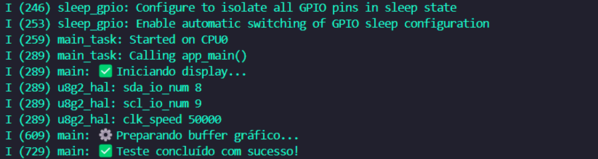

# _Display Oled_


---

## Sumário

- [Histórico de Versão](#histórico-de-versão)
- [Resumo](#resumo)
- [Objetivo](#objetivo)
- [Links para estudos](#links-para-estudos)
- [Pinos do projeto eletrônico](#pinos-do-projeto-eletrônico)
- [Bibliotecas](#bibliotecas)
- [Configuração do Firmware](#configuração-do-firmware)
- [Informações](#informações)


## Histórico de versão

| Versão | Data       | Autor         | Descrição          |
|--------|------------|---------------|--------------------|
| 1.0.0  | 04/06/2025 | Adenilton R   | Inicio do projeto  |

---

## Resumo

Este projeto implementa o controle de displays OLED utilizando a biblioteca U8G2 no ESP32 com o framework ESP-IDF. O sistema oferece:

- Suporte a múltiplos controladores OLED (SSD1306/SSD1309/SSD1325/SSD1327/SSD1331/SSD1351/SSD1362)
- Comunicação via I2C e SPI
- Configuração flexível de pinos GPIO
- Operação em tempo real com FreeRTOS
- Interface gráfica para desenho de elementos e texto

## Objetivo

- **Controle de displays OLED** com biblioteca U8G2
- **Suporte duplo** para comunicação I2C e SPI
- **Configuração de pinos** flexível (reset, DC, CS)
- **Renderização gráfica** de textos e elementos básicos
- **Logs detalhados** via serial
- **Otimização** para ESP32-S3

## Links para estudos

[**Documentação ESP-IDF**](https://docs.espressif.com/projects/esp-idf/en/v5.4.0/esp32s3/index.html)

[**Biblioteca U8G2**](https://github.com/olikraus/u8g2/wiki)

[**FreeRTOS**](https://www.freertos.org/)

[**Vídeo exemplo**](https://www.youtube.com/watch?v=-6BBtYKekRw&themeRefresh=1)

[**Documentação do u8g2**](https://github.com/mkfrey/u8g2-hal-esp-idf)

[**u8g2**](https://github.com/olikraus/u8g2)

## Pinos do projeto eletrônico

| **Pino** | **Conexão**       | **Tipo** | **Descrição** |
|----------|-------------------|----------|---------------|
| GPIO8    | SDA (I2C)         | I2C      | Dados I2C     |
| GPIO9    | SCL (I2C)         | I2C      | Clock I2C     |

Pinos alternativos para SPI:

```c
GPIO_NUM_13  // CLK
GPIO_NUM_11  // MOSI
GPIO_NUM_10  // CS
GPIO_NUM_12  // DC
GPIO_NUM_9   // RESET
```

## Bibliotecas

[main.c](https://github.com/AdeniltonR/Firmware-para-IDF-Espressif/blob/main/ESP-IDF/display-oled/main/main.c)

[display_oled.c](https://github.com/AdeniltonR/Firmware-para-IDF-Espressif/blob/main/ESP-IDF/display-oled/components/display_oled/display_oled.c)

[display_oled.h](https://github.com/AdeniltonR/Firmware-para-IDF-Espressif/blob/main/ESP-IDF/display-oled/components/display_oled/include/display_oled.h)

[CMakeLists.txt](https://github.com/AdeniltonR/Firmware-para-IDF-Espressif/blob/main/ESP-IDF/display-oled/components/display_oled/CMakeLists.txt)

## Configuração do Firmware

Inicialização do display:

```c
//---configuração inicial da HAL com valores padrão---
u8g2_esp32_hal_t u8g2_esp32_hal = U8G2_ESP32_HAL_DEFAULT;

//---define os pinos I2C---
u8g2_esp32_hal.bus.i2c.sda = PIN_sda;      // Configura pino SDA
u8g2_esp32_hal.bus.i2c.scl = PIN_scl;      // Configura pino SCL

//---inicializa a HAL com as configurações---
u8g2_esp32_hal_init(u8g2_esp32_hal);

//---estrutura principal do u8g2---
u8g2_t u8g2;

//---configura o display SSD1306 128x32 com comunicação I2C---
u8g2_Setup_ssd1306_i2c_128x32_univision_f(
  &u8g2,                                 // Ponteiro para estrutura u8g2
  U8G2_R0,                               // Orientação (0 graus)
  u8g2_esp32_i2c_byte_cb,                // Callback para comunicação I2C
  u8g2_esp32_gpio_and_delay_cb           // Callback para GPIO e delays
);

//---define endereço I2C do display (0x3C << 1 = 0x78)---
u8x8_SetI2CAddress(&u8g2.u8x8, 0x78);

//---sequência de inicialização do display---
ESP_LOGI(TAG, "✅ Iniciando display...");
u8g2_InitDisplay(&u8g2);                   // Inicializa hardware
```

Exemplo de uso:

```c
//---limpar buffer e desenhar elementos---
u8g2_ClearBuffer(&u8g2);
u8g2_DrawBox(&u8g2, 0, 26, 80, 6);         // Caixa preenchida
u8g2_DrawFrame(&u8g2, 0, 26, 100, 6);      // Moldura
u8g2_SetFont(&u8g2, u8g2_font_ncenB14_tr);
u8g2_DrawStr(&u8g2, 2, 17, "CEDEPS");
u8g2_SendBuffer(&u8g2);                    // Envia para o display
```

Funções principais:

- **`u8g2_esp32_hal_init()`**: Inicializa a configuração de pinos
- **`u8g2_Setup_*()`**: Configura o display específico
- **`u8g2_Draw*()`**: Funções de desenho gráfico
- **`u8g2_SendBuffer()`**: Atualiza o display

Dados do monitor serial:



## Informações

| Info        | Modelo           |
|-------------|------------------|
| uC          | ESP32-S3         |
| Placa       | ESP32-S3 Module  |
| Arquitetura | Xtensa / RISC    |
| IDE         | IDF v5.4.0       |