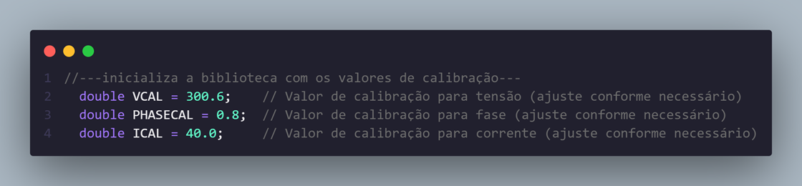
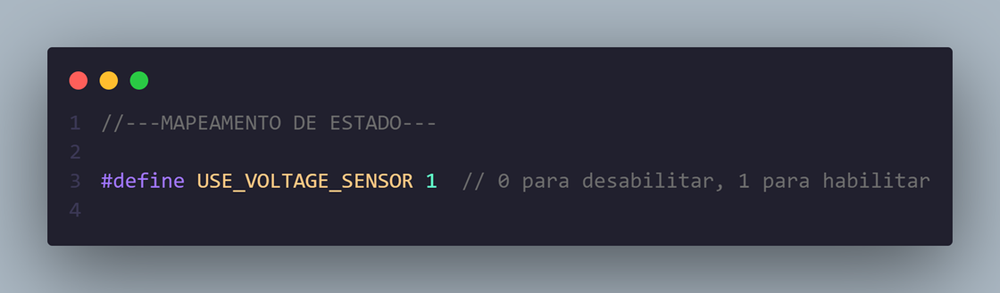
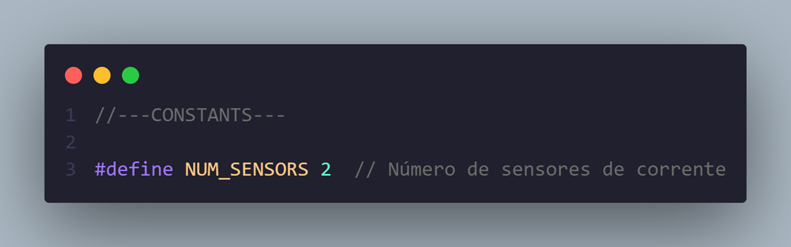
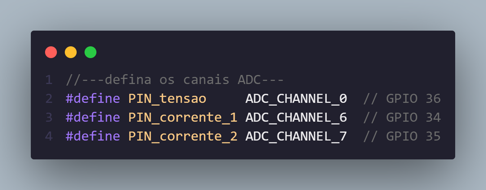
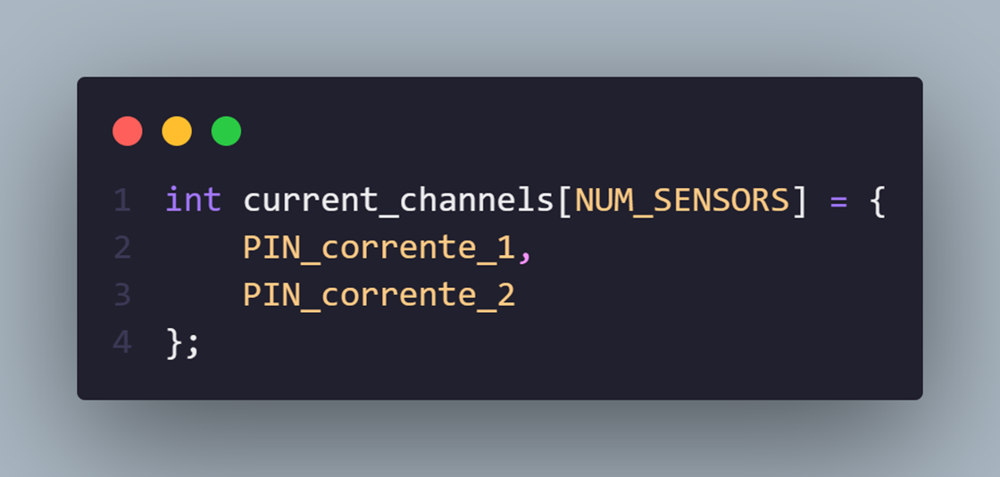
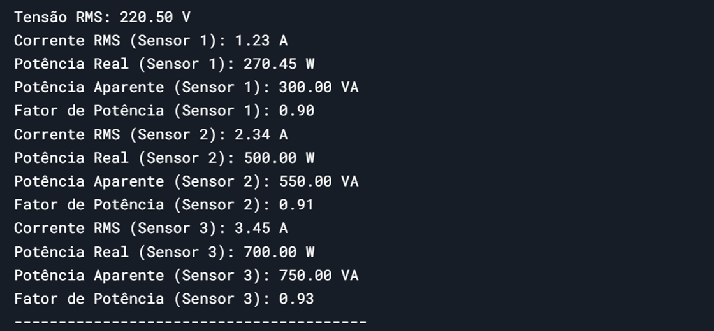

# _Emonlib_

---

## Sumário

- [Histórico de Versão](#histórico-de-versão)
- [Resumo](#resumo)
- [Objetivo](#objetivo)
- [Links para estudos](#links-para-estudos)
- [Pinos do projeto eletrônico](#pinos-do-projeto-eletrônico)
- [Bibliotecas](#bibliotecas)
- [Configuração do Firmware](#configuração-do-firmware)
- [Informações](#informações)

## Histórico de versão

| Versão | Data       | Autor         | Descrição                              |
|--------|------------|---------------|----------------------------------------|
| 1.0.0  | 11/03/2025 | Adenilton R   | Inicio do projeto                      |

---

## Resumo

Este projeto tem como objetivo implementar uma biblioteca para medição de tensão e corrente utilizando o ESP32 e o framework ESP-IDF. A biblioteca é baseada na `EmonLib`, originalmente desenvolvida para Arduino, e foi adaptada para funcionar no ambiente do ESP-IDF, permitindo a leitura de sensores de corrente e tensão com alta precisão. O projeto é voltado para aplicações de monitoramento de energia, como medidores de consumo elétrico em tempo real.

A biblioteca suporta a leitura de múltiplos sensores de corrente e é configurável para diferentes taxas de amostragem e calibração. Além disso, o código foi otimizado para funcionar com o ADC de 12 bits do ESP32, garantindo medições precisas e eficientes.

## Objetivo

O objetivo principal deste projeto é fornecer uma solução confiável e de baixo custo para medição de energia em sistemas embarcados baseados no ESP32. Os objetivos específicos incluem:

1. **Adaptação da EmonLib para o ESP-IDF**:
    - Migrar a biblioteca `EmonLib` do Arduino para o ESP-IDF, aproveitando as funcionalidades avançadas do ESP32, como o ADC de 12 bits.
2. **Suporte a Múltiplos Sensores**:
    - Implementar a leitura de mais de um sensore de corrente simultaneamente, permitindo o monitoramento de diferentes fases ou circuitos em um sistema elétrico.
3. **Precisão e Calibração**:
    - Garantir medições precisas de tensão e corrente através de coeficientes de calibração ajustáveis, permitindo a adaptação a diferentes sensores e condições de operação.
4. **Integração com Sistemas Existentes**:
    - Facilitar a integração da biblioteca com outros projetos no ESP-IDF, fornecendo uma API simples e bem documentada.
5. **Aplicações Práticas**:
    - Desenvolver um exemplo de aplicação que demonstre o uso da biblioteca em um medidor de energia residencial ou industrial, com exibição dos dados em tempo real via interface serial.

## Links para estudos

[**emonlib-esp-idf**](https://github.com/uktechbr/emonlib-esp-idf)

[**EmonLib**](https://github.com/openenergymonitor/EmonLib)

## Pinos do projeto eletrônico

| Nome           | Canal         | Pino |
|----------------|---------------|------|
| PIN_tensao     | ADC_CHANNEL_0 | 36   |
| PIN_corrente_1 | ADC_CHANNEL_6 | 34   |
| PIN_corrente_2 | ADC_CHANNEL_7 | 35   |

Canais ADC1:

| Canal         | Pino |
|---------------|------|
| ADC_CHANNEL_0 | 36   |
| ADC_CHANNEL_1 | 37   |
| ADC_CHANNEL_2 | 38   |
| ADC_CHANNEL_3 | 39   |
| ADC_CHANNEL_4 | 32   |
| ADC_CHANNEL_5 | 33   |
| ADC_CHANNEL_6 | 34   |
| ADC_CHANNEL_7 | 35   |

## Bibliotecas

[emonlib-esp-idf.c](https://github.com/AdeniltonR/Firmware-para-IDF-Espressif/blob/main/ESP-IDF/emonlib/components/emonlib-esp-idf/emonlib-esp-idf.c)

[emonlib-esp-idf.h](https://github.com/AdeniltonR/Firmware-para-IDF-Espressif/blob/main/ESP-IDF/emonlib/components/emonlib-esp-idf/include/emonlib-esp-idf.h)

[CMakeLists.txt](https://github.com/AdeniltonR/Firmware-para-IDF-Espressif/blob/main/ESP-IDF/emonlib/components/emonlib-esp-idf/CMakeLists.txt)

## Configuração do Firmware

Essa biblioteca foi atualizada do site [Emonlin-esp-idf](https://github.com/uktechbr/emonlib-esp-idf), ela está configurado para três sensores, dois de corrente e um de tensão.
Para calibração dos sensores pode ser ajustado aqui na **main.c**:

Para abilitar a tensão configure dentro da **emonlib-esp-idf.c**:

Para adicionar mais sensor de corrente adicione a quantidade dentro da **emonlib-esp-idf.h**:

Adicione os canais do pino para ADC1 dentro da **emonlib-esp-idf.c**:

Adicione dentro do `current_channels` dentro da **emonlib-esp-idf.c**:

Dados do Serial:

## Informações

| Info        | Modelo        |
|-------------|---------------|
| uC          | ESP32 32D     |
| Placa       | ESP32 Module  |
| Arquitetura | Xtensa / RISC |
| IDE         | IDF v5.4.0    |