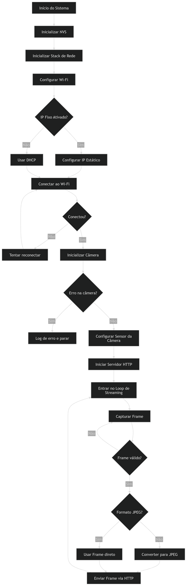
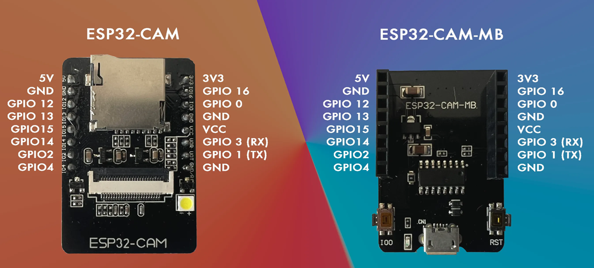

# _Projeto - ESP32-CAM_


---

## Sumário

- [Histórico de Versão](#histórico-de-versão)
- [Resumo](#resumo)
- [Objetivo](#objetivo)
- [Fluxograma](#fluxograma)
- [Configuração do Ambiente de Desenvolvimento](#configuração-do-ambiente-de-desenvolvimento)
- [Links para estudos](#links-para-estudos)
- [Pinos do projeto eletrônico](#pinos-do-projeto-eletrônico)
- [Bibliotecas](#bibliotecas)
- [Estrutura do Projeto](#estrutura-do-projeto)
- [Configuração via Menuconfig](#configuração-via-menuconfig)
- [Funcionamento do Firmware](#funcionamento-do-firmware)
- [Inicialização esperada](#inicialização-esperada)
- [Observações Técnicas](#observações-técnicas)
- [Possíveis Melhorias Futuras](#possíveis-melhorias-futuras)
- [Informações](#informações)

## Histórico de versão

| Versão | Data       | Autor         | Descrição          |
|--------|------------|---------------|--------------------|
| 1.0.0  | 19/03/2026 | Adenilton R   | Inicio do projeto  |

---

## Resumo

Este projeto implementa um firmware embarcado utilizando o ESP32-CAM com ESP-IDF v5.4, responsável pela captura de imagens e transmissão em tempo real através de um servidor HTTP com stream MJPEG.

O sistema realiza:

- Inicialização da câmera (sensor OV2640)
- Conexão Wi-Fi configurável via menuconfig
- Configuração opcional de IP fixo
- Execução de servidor HTTP embarcado
- Transmissão contínua de frames via rede

O firmware foi desenvolvido com FreeRTOS, garantindo execução eficiente e controle de tarefas.

## Objetivo

- Implementar um firmware para transformar o ESP32-CAM em uma câmera IP
- Permitir configuração flexível via menuconfig
- Disponibilizar stream de vídeo via HTTP
- Criar base reutilizável para aplicações embarcadas com visão

## Fluxograma



## Configuração do Ambiente de Desenvolvimento

Este guia descreve os passos necessários para configurar o ambiente e executar o firmware do **ESP32-CAM** utilizando **ESP-IDF v5.4.0**

### Clonar o repositório

```
git clone https://github.com/AdeniltonR/Detector-Dracco.git
cd Firmware/esp32_cam
```

### Abrir no VS Code

1. Abra o **VS Code**
2. Clique em:
    - `File → Open Folder`
3. Selecione a pasta do projeto

### Configurar o ambiente ESP-IDF

Certifique-se de que a extensão **ESP-IDF** está instalada no VS Code.

Caso não esteja:

- Instale a extensão **Espressif IDF**

### Configurar o projeto (menuconfig)

Abra o terminal e execute:

```
idf.py menuconfig
```

### Ajustes obrigatórios

#### Flash

```
Serial flasher config → Flash size → 4 MB
```

#### Frequência

```
Serial flasher config → Flash frequency → 80 MHz
```

#### PSRAM

```
Component config → ESP32-specific → Support for external RAM → ENABLE
```

### Configurar Wi-Fi

```
Configuração da Aplicação → Configuração do Wi-Fi
```

Preencha:

- SSID da rede
- Senha do Wi-Fi
- Número máximo de tentativas

### Configurar IP (opcional - recomendado)

```
Configuração da Aplicação → Configuração de Rede
```

Defina:

- IP fixo (ex: 192.168.15.30)
- Gateway (ex: 192.168.15.1)
- Máscara (ex: 255.255.255.0)

### Selecionar modelo da câmera

```
Configuração da Aplicação → Seleção da placa
```

Selecione:

```
AiThinker ESP32-CAM
```

### Instalar dependências

O projeto utiliza o driver oficial da câmera:

```
espressif/esp32-camera
```

A instalação é automática ao compilar o projeto.

### Compilar o projeto

```
idf.py build
```

### Gravar no ESP32

```
idf.py flash
```

### Monitor serial

```
idf.py monitor
```

### Acessar a câmera

Após inicialização, acesse no navegador:

```
http://IP_DO_ESP32
```

Exemplo:

```
http://192.168.15.30
```

### Observações Importantes

- Utilize **Flash 4MB**, caso contrário ocorrerá erro de boot
- PSRAM é necessária para melhor desempenho da câmera
- Wi-Fi deve estar na mesma rede do computador
- Logs como `wifi:<ba-add>` são normais

## Links para estudos

[**Documentação ESP-IDF**](https://docs.espressif.com/projects/esp-idf/en/v5.4.0/esp32s3/index.html)

[**Guia de pinagem do ESP32-CAM AI-Thinker: Uso dos GPIOs explicado**](https://randomnerdtutorials.com/esp32-cam-ai-thinker-pinout/)

[**Servidor Web de Transmissão ao Vivo ESP32-CAM ESP-IDF**](https://esp32tutorials.com/esp32-cam-esp-idf-live-streaming-web-server/)

[**FreeRTOS**](https://www.freertos.org/)

## Pinos do projeto eletrônico

| **Pino** | **Conexão** | **Tipo** | **Descrição** |
|----------|-------------|----------|---------------|
| GPIO1    | TX (UART)   | UART     | Transmissão   |
| GPIO3    | RX (UART)   | UART     | Recepção      |



## Bibliotecas

[camera_pins.h](https://github.com/AdeniltonR/Firmware-para-IDF-Espressif/blob/main/ESP-IDF/esp32_cam/main/camera_pins.h)

[CMakerLists.txt](https://github.com/AdeniltonR/Firmware-para-IDF-Espressif/blob/main/ESP-IDF/esp32_cam/main/CMakeLists.txt)

[connect_wifi.c](https://github.com/AdeniltonR/Firmware-para-IDF-Espressif/blob/main/ESP-IDF/esp32_cam/main/connect_wifi.c)

[connect_wifi.h](https://github.com/AdeniltonR/Firmware-para-IDF-Espressif/blob/main/ESP-IDF/esp32_cam/main/connect_wifi.h)

[idf_componente.yml](https://github.com/AdeniltonR/Firmware-para-IDF-Espressif/blob/main/ESP-IDF/esp32_cam/main/idf_component.yml)

[Kconfig.projbuild](https://github.com/AdeniltonR/Firmware-para-IDF-Espressif/blob/main/ESP-IDF/esp32_cam/main/Kconfig.projbuild)

[main.c](https://github.com/AdeniltonR/Firmware-para-IDF-Espressif/blob/main/ESP-IDF/esp32_cam/main/main.c)

## Estrutura do Projeto

```
main/
├── main.c# Inicialização do sistema e servidor HTTP
├── connect_wifi.c# Gerenciamento da conexão Wi-Fi
├── connect_wifi.h
├── camera_pins.h# Definição dos pinos da câmera
└── Kconfig.projbuild# Configurações via menuconfig
```

## Configuração via Menuconfig

O projeto utiliza o sistema nativo do ESP-IDF para configuração.

### Acessar menuconfig

```
idf.py menuconfig
```

### Parâmetros configuráveis

#### Wi-Fi

- SSID da rede
- Senha
- Número máximo de tentativas

#### Rede

- Ativar IP fixo
- Endereço IP
- Gateway
- Máscara de rede

#### Hardware

- Seleção do modelo da placa (ESP32-CAM)

## Funcionamento do Firmware

O fluxo de execução do sistema segue a seguinte sequência:

### Inicialização

1. Inicializa memória NVS
2. Inicializa stack de rede (TCP/IP)
3. Conecta ao Wi-Fi
4. Configura IP (fixo ou DHCP)
5. Inicializa câmera
6. Inicia servidor HTTP

### Captura de imagem

- A câmera captura frames no formato **JPEG**
- Os dados são armazenados em buffer na PSRAM
- Frames são enviados continuamente

### Streaming MJPEG

- Servidor HTTP responde na rota `/`
- Envia stream multipart (`multipart/x-mixed-replace`)
- Navegador exibe como vídeo em tempo real

## Inicialização esperada

```
Wi-Fi conectado!
IP obtido: 192.168.X.X
Câmera inicializada com sucesso
Servidor HTTP iniciado
```

## Observações Técnicas

- Uso de **PSRAM é obrigatório** para melhor desempenho
- Resolução recomendada: VGA ou inferior para estabilidade
- Wi-Fi ativo pode impactar FPS
- Logs do tipo `wifi:<ba-add>` são normais
- Erros de porta COM são do ambiente de desenvolvimento

## Possíveis Melhorias Futuras

- Endpoint para captura de imagem (`/capture`)
- Controle de qualidade/resolução via HTTP
- Autenticação de acesso
- Buffer duplo para aumento de FPS
- Integração com backend

## Informações

| Info        | Modelo           |
|-------------|------------------|
| uC          | ESP32            |
| Placa       | ESP32-CAM        |
| Arquitetura | Xtensa / RISC    |
| IDE         | IDF v5.4.0       |