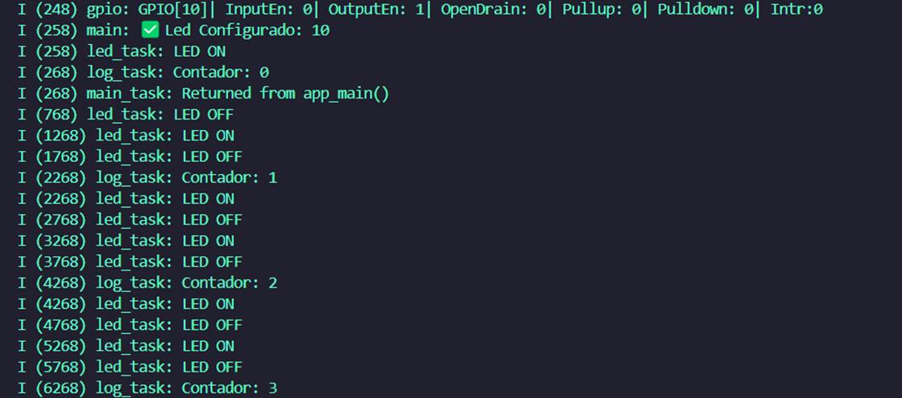

# _Pisca Led_


---

## Sumário

- [Histórico de Versão](#histórico-de-versão)
- [Resumo](#resumo)
- [Objetivo](#objetivo)
- [Links para estudos](#links-para-estudos)
- [Pinos do projeto eletrônico](#pinos-do-projeto-eletrônico)
- [Bibliotecas](#bibliotecas)
  - [Radio Controle](#radio-controle)
  - [Receptor](#receptor)
- [Configuração do Firmware](#configuração-do-firmware)
- [Informações](#informações)

## Histórico de versão

| Versão | Data       | Autor         | Descrição          |
|--------|------------|---------------|--------------------|
| 1.0.0  | 05/08/2025 | Adenilton R   | Inicio do projeto  |

---

## Resumo

Este projeto demonstra o uso do **FreeRTOS** no **ESP32-C3** com **ESP-IDF** para executar duas tarefas independentes:

- **Tarefa 1:** Piscar um LED conectado ao GPIO 10 a cada 500 ms.
- **Tarefa 2:** Exibir logs periódicos no console a cada 2 segundos.

O objetivo é servir como exemplo introdutório para aplicações multitarefa no ESP32, utilizando o agendador do FreeRTOS.

## Objetivo

- Mostrar como criar e executar múltiplas tarefas no FreeRTOS.
- Demonstrar controle de pinos GPIO no ESP32-C3.
- Utilizar logs estruturados (`ESP_LOGI`) para depuração.
- Servir como base para projetos mais complexos que necessitem de execução concorrente.

## Links para estudos

- [**Documentação ESP-IDF**](https://docs.espressif.com/projects/esp-idf/en/v5.4.0/esp32c3/index.html)
- [**FreeRTOS**](https://www.freertos.org/)
- [**Documentação GPIO ESP-IDF**](https://docs.espressif.com/projects/esp-idf/en/latest/esp32/api-reference/peripherals/gpio.html)
- [**ESP_LOG**](https://docs.espressif.com/projects/esp-idf/en/latest/esp32/api-reference/system/log.html)
- [**esp-rs**](https://github.com/esp-rs)

## Pinos do projeto eletrônico

| Pino   | Conexão | Tipo  | Descrição |
|--------|---------|-------|-----------|
| GPIO10 | LED     | Saída | Pisca LED |

## Bibliotecas

[main.c](https://github.com/AdeniltonR/Firmware-para-IDF-Espressif/blob/main/ESP-IDF/pisca-led/main/main.c)

## Configuração do Firmware

**Exemplo de criação das tarefas:**

```c
//---cria as tarefas---
xTaskCreate(tarefa_pisca_led, "tarefa_pisca_led", 2048, NULL, 5, NULL);
xTaskCreate(tarefa_log,      "tarefa_log",      2048, NULL, 5, NULL);
```

**Exemplo da tarefa para piscar LED:****

```c
/**
 * @brief Tarefa responsável por piscar o LED
 *
 * Alterna o estado do pino definido em PIN_led a cada 500ms,
 * enviando mensagens de log informando o estado atual do LED.
 *
 * @param pvParameter Parâmetro opcional (não utilizado).
 */
void tarefa_pisca_led(void *pvParameter) {
    bool estado = false;
    while (1) {
        estado = !estado;
        gpio_set_level(PIN_led, estado);
        ESP_LOGI(TAG_LED, "LED %s", estado ? "ON" : "OFF");
        vTaskDelay(pdMS_TO_TICKS(500)); // 500 ms
    }
}
```

**Exemplo da tarefa de log:**

```c
/**
 * @brief Tarefa responsável por gerar logs periódicos
 *
 * Envia mensagens no console a cada 2 segundos, contendo
 * um contador incremental para monitoramento.
 *
 * @param pvParameter Parâmetro opcional (não utilizado).
 */
void tarefa_log(void *pvParameter) {
    int contador = 0;
    while (1) {
        ESP_LOGI(TAG_LOG, "Contador: %d", contador++);
        vTaskDelay(pdMS_TO_TICKS(2000)); // 2 segundos
    }
}
```

**Dados do monitor serial:**



## Informações

| Info        | Modelo           |
|-------------|------------------|
| uC          | ESP32 C3         |
| Placa       | ESP32-C3 Module  |
| Arquitetura | RISC-V           |
| IDE         | IDF v5.4.0       |