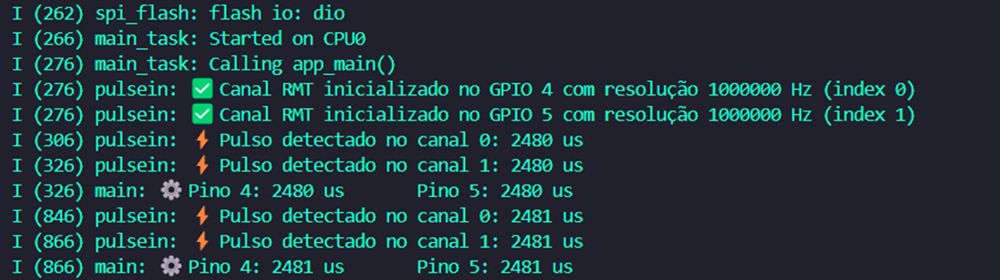

# _Pulsein IDF_


---

## Sumário

- [Histórico de Versão](#histórico-de-versão)
- [Resumo](#resumo)
- [Objetivo](#objetivo)
- [Links para estudos](#links-para-estudos)
- [Pinos do projeto eletrônico](#pinos-do-projeto-eletrônico)
- [Bibliotecas](#bibliotecas)
- [Configuração do Firmware](#configuração-do-firmware)
- [Informações](#informações)


## Histórico de versão

| Versão | Data       | Autor         | Descrição          |
|--------|------------|---------------|--------------------|
| 1.0.0  | 25/04/2025 | Adenilton R   | Inicio do projeto  |

---

## Resumo

Este projeto implementa a leitura precisa de pulsos digitais utilizando o periférico RMT do ESP32 32D com o framework ESP-IDF. O sistema oferece:

- Leitura de pulsos digitais com resolução de até 1μs
- Suporte a múltiplos canais simultâneos (até 4)
- Timeout configurável para operação
- Logs detalhados via serial
- Operação em tempo real com FreeRTOS

## Objetivo

- **Leitura precisa de pulsos** usando periférico RMT
- **Multiplos canais** com até 4 pinos simultâneos
- **Resolução configurável** (1μs a 10μs)
- **Timeout ajustável** para cada leitura
- **Logs detalhados** via serial
- **Configuração flexível** de pinos e parâmetros

## Links para estudos

[**Documentação ESP-IDF**](https://docs.espressif.com/projects/esp-idf/en/v5.4.0/esp32s3/index.html)

[**Documentação RMT**](https://docs.espressif.com/projects/esp-idf/en/latest/esp32s3/api-reference/peripherals/rmt.html)

[**FreeRTOS**](https://www.freertos.org/)

## Pinos do projeto eletrônico

| **Pino** | **Conexão**       | **Tipo** | **Descrição** |
|----------|-------------------|----------|---------------|
| GPIO4    | Entrada digital 1 | Entrada  | Canal RMT 0   |
| GPIO5    | Entrada digital 2 | Entrada  | Canal RMT 1   |

Pinos recomendados para leitura RMT:

```c
GPIO_NUM_4
GPIO_NUM_5
GPIO_NUM_6
GPIO_NUM_7
GPIO_NUM_8
GPIO_NUM_9
GPIO_NUM_10
GPIO_NUM_11
GPIO_NUM_12
GPIO_NUM_13
GPIO_NUM_14
GPIO_NUM_15
GPIO_NUM_16
GPIO_NUM_17
```

## Bibliotecas

[main.c](https://github.com/AdeniltonR/Firmware-para-IDF-Espressif/blob/main/ESP-IDF/pulsein_idf/main/main.c)

[pulsein_idf.c](https://github.com/AdeniltonR/Firmware-para-IDF-Espressif/blob/main/ESP-IDF/pulsein_idf/components/pulsein_idf/pulsein_idf.c)

[pulsein_idf.h](https://github.com/AdeniltonR/Firmware-para-IDF-Espressif/blob/main/ESP-IDF/pulsein_idf/components/pulsein_idf/include/pulsein_idf.h)

[CMakeLists.txt](https://github.com/AdeniltonR/Firmware-para-IDF-Espressif/blob/main/ESP-IDF/pulsein_idf/components/pulsein_idf/CMakeLists.txt)

## Configuração do Firmware

Inicialização dos canais RMT:

```c
rmt_pulsein_init(PIN_ch1, 0, 1000000); // 1 MHz resolução (1μs)
rmt_pulsein_init(PIN_ch2, 1, 1000000);
```

Leitura de pulsos:

```c
//---leitura dos pulsos com timeout de 2.5 segundo (2.5000000 us)---
int64_t pulse1 = rmt_pulsein_read_us(0, 2500000);
int64_t pulse2 = rmt_pulsein_read_us(1, 2500000);
```

Funções principais:

- **`rmt_pulsein_init()`**: Inicializa um canal RMT
- **`rmt_pulsein_deinit()`**: Desativa um canal RMT
- **`rmt_pulsein_read_us()`**: Lê a duração de um pulso em microssegundos

Dados do monitor serial:



## Informações

| Info        | Modelo           |
|-------------|------------------|
| uC          | ESP32 32D        |
| Placa       | ESP32 32D Module |
| Arquitetura | Xtensa / RISC    |
| IDE         | IDF v5.4.0       |