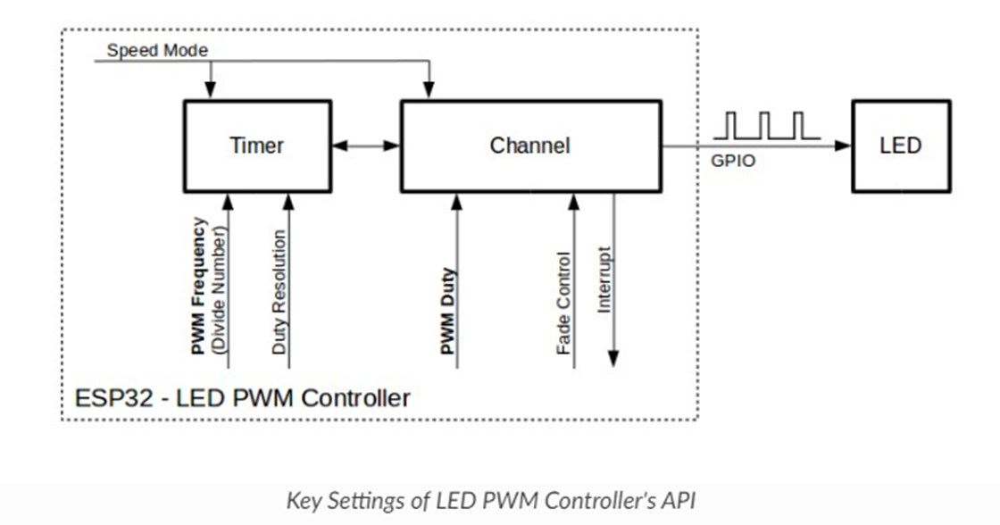
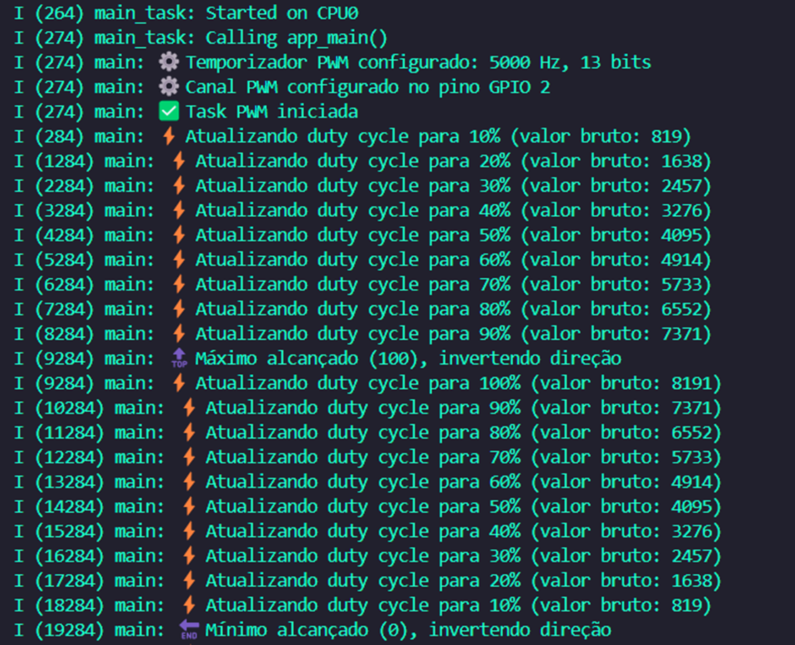

# _Controle PWM com RTOS_


---

## Sumário

- [Histórico de Versão](#histórico-de-versão)
- [Resumo](#resumo)
- [Objetivo](#objetivo)
- [Links para estudos](#links-para-estudos)
- [Pinos do projeto eletrônico](#pinos-do-projeto-eletrônico)
- [Bibliotecas](#bibliotecas)
- [Configuração do Firmware](#configuração-do-firmware)
- [Informações](#informações)


## Histórico de versão

| Versão | Data       | Autor         | Descrição          |
|--------|------------|---------------|--------------------|
| 1.0.0  | 16/05/2025 | Adenilton R   | Inicio do projeto  |

---

## Resumo

Este projeto implementa um controle PWM com FreeRTOS no ESP32, permitindo ajuste automático do duty cycle em incrementos de 10%. O sistema é ideal para aplicações que requerem controle preciso de dispositivos PWM como LEDs, motores ou servos.

## Objetivo

- Controle PWM com resolução de 13 bits (8192 níveis)

- Frequência ajustável (configurada para 5kHz)

- Incremento automático do duty cycle em passos de 10%

- Limitação automática entre 0-100%

- Logs detalhados via serial

- Operação em tempo real com FreeRTOS

## Links para estudos

[**Informações dos GPIO & RTC GPIO**](https://docs.espressif.com/projects/esp-idf/en/latest/esp32/api-reference/peripherals/gpio.html)

[**Referência de pinagem do ESP32: Quais pinos GPIO você deve usar**](https://randomnerdtutorials.com/esp32-pinout-reference-gpios/)

[**Controle de LED (LEDC) - PWM**](https://docs.espressif.com/projects/esp-idf/en/latest/esp32/api-reference/peripherals/ledc.html)

## Pinos do projeto eletrônico

| Pino ESP32-S3 | Conexão            | Tipo      | Descrição                  | Observações                        |
|---------------|--------------------|-----------|----------------------------|------------------------------------|
| GPIO2         | Sinal led          | Saída PWM | Canal LEDC 1 (Timer 0)     | Configurado para 5000Hz            |

## Bibliotecas

[main.c](https://github.com/AdeniltonR/Firmware-para-IDF-Espressif/blob/main/ESP-IDF/pwm-rtos/main/main.c)

## Configuração do Firmware

Funcionamento do PWM:



Parâmetros PWM:

```
ledc_timer_config_t ledc_timer = {
    .speed_mode = LEDC_LOW_SPEED_MODE,
    .timer_num = LEDC_TIMER_0,
    .duty_resolution = LEDC_TIMER_13_BIT, // 8192 níveis
    .freq_hz = 5000,                      // 5kHz
    .clk_cfg = LEDC_AUTO_CLK
};
```

Funções Principais:

- **pwm_init():** Configura hardware PWM

- **pwm_task():** Task RTOS que gerencia o duty cycle

- **app_main():** Ponto de entrada do firmware

Dados do monitor serial:



## Informações

| Info        | Modelo           |
|-------------|------------------|
| uC          | ESP32 32D        |
| Placa       | ESP32 Module     |
| Arquitetura | Xtensa / RISC    |
| IDE         | IDF v5.4.0       |