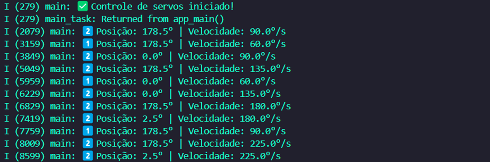

# _Servo Motor_


---

## Sumário

- [Histórico de Versão](#histórico-de-versão)
- [Resumo](#resumo)
- [Objetivo](#objetivo)
- [Links para estudos](#links-para-estudos)
- [Pinos do projeto eletrônico](#pinos-do-projeto-eletrônico)
- [Bibliotecas](#bibliotecas)
- [Configuração do Firmware](#configuração-do-firmware)
- [Informações](#informações)


## Histórico de versão

| Versão | Data       | Autor         | Descrição          |
|--------|------------|---------------|--------------------|
| 1.0.0  | 03/04/2025 | Adenilton R   | Inicio do projeto  |

---

## Resumo

Este projeto implementa o controle preciso de dois servo motores utilizando o ESP32-S3 com o framework ESP-IDF. O sistema oferece:

- Controle independente de dois servos
- Movimento suave com velocidade ajustável
- Leitura da posição atual
- Limitação automática de ângulos
- Operação em tempo real com FreeRTOS

## Objetivo

- **Controle PWM preciso** usando periférico LEDC
- **Velocidade configurável** para cada servo (30°-270°/s)
- **Movimento suave** com aceleração controlada
- **Verificação de limites** (0°-180°)
- **Logs detalhados** via serial
- **Configuração flexível** de pinos e parâmetros

## Links para estudos

[**Documentação ESP-IDF**](https://docs.espressif.com/projects/esp-idf/en/v5.4.0/esp32s3/index.html)

[**Controle Servo**](https://docs.espressif.com/projects/esp-iot-solution/en/latest/motor/servo.html)

[**FreeRTOS**](https://www.freertos.org/)

[**Especificação de Servos**](https://www.robocore.net/servo-motor/servo-towerpro-mg996r-metalico?srsltid=AfmBOoqwzpPs5Godh6dH1E9O8H_zZU9LtfGWcnDBq3MYAe4NK0lT3fNZ)

## Pinos do projeto eletrônico

| Pino ESP32-S3 | Conexão            | Tipo      | Descrição                  | Observações                        |
|---------------|--------------------|-----------|----------------------------|------------------------------------|
| GPIO20        | Sinal Servo 1      | Saída PWM | Canal LEDC 0 (Timer 0)     | Configurado para 50Hz              |
| GPIO2         | Sinal Servo 2      | Saída PWM | Canal LEDC 1 (Timer 0)     | Configurado para 50Hz              |
| 6V            | Alimentação Servos | Fonte     | Tensão para os servos      | Recomendado fonte externa para >2A |
| GND           | Terra              | Terra     | Terra comum para os servos | Conectar todos os GNDs juntos      |

Pinos recomendados para servos:

```
GPIO_NUM_0*   (precaução no boot)
GPIO_NUM_1    (U0TXD - cuidado com debug)
GPIO_NUM_2
GPIO_NUM_3    (U0RXD - cuidado com debug)
GPIO_NUM_4
GPIO_NUM_5
GPIO_NUM_6
GPIO_NUM_7
GPIO_NUM_8
GPIO_NUM_9
GPIO_NUM_10
GPIO_NUM_11
GPIO_NUM_12
GPIO_NUM_13
GPIO_NUM_14
GPIO_NUM_15
GPIO_NUM_16
GPIO_NUM_17
GPIO_NUM_18
GPIO_NUM_19
GPIO_NUM_20
GPIO_NUM_21
```

## Bibliotecas

[main.c]()

[servo_motor.c]()

[servo_motor.h]()

[CMakeLists.txt]()

## Configuração do Firmware

Ajuste os parâmetros dos servos:

```
static servo_config_t servo_cfg = {
    .max_angle = 180,       // Ângulo máximo (graus)
    .min_width_us = 500,    // Largura de pulso mínima (500us)
    .max_width_us = 2500,   // Largura de pulso máxima (2500us)
    .freq = 50,             // Frequência PWM (50Hz)
    // ... outros parâmetros
};
```

Configure a velocidade:

```
servo_speed_t speed_cfg = {
    .speed_deg_per_sec = 90.0f,  // Velocidade em graus/segundo
    .step_size = 3               // Tamanho do passo (graus)
};
```

Funções principais:

- `iot_servo_init()`: Inicializa o controle dos servos
- `iot_servo_write_angle()`: Move o servo para um ângulo específico
- `iot_servo_read_angle()`: Lê a posição atual do servo
- `move_servo_smoothly()`: Movimento suave com controle de velocidade

Dados do monitor serial:



## Informações

| Info        | Modelo           |
|-------------|------------------|
| uC          | ESP32-S3         |
| Placa       | ESP32-S3 Module  |
| Arquitetura | Xtensa / RISC    |
| IDE         | IDF v5.4.0       |