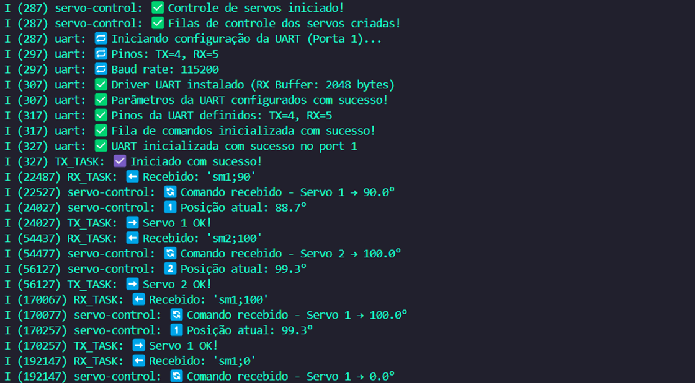

# _Servo UART_


---

## Sumário

- [Histórico de Versão](#histórico-de-versão)
- [Resumo](#resumo)
- [Objetivo](#objetivo)
- [Links para estudos](#links-para-estudos)
- [Pinos do projeto eletrônico](#pinos-do-projeto-eletrônico)
- [Bibliotecas](#bibliotecas)
- [Configuração do Firmware](#configuração-do-firmware)
- [Informações](#informações)


## Histórico de versão

| Versão | Data       | Autor         | Descrição          |
|--------|------------|---------------|--------------------|
| 1.0.0  | 03/04/2025 | Adenilton R   | Inicio do projeto  |

---

## Resumo

Este projeto implementa o controle de dois servomotores via comunicação UART entre um ESP32-S3 e um Raspberry Pi. As principais características incluem:

- Controle independente de dois servomotores
- Comunicação UART full-duplex
- Movimento suave com controle de velocidade
- Sistema de filas para comandos assíncronos
- Confirmação de recebimento de comandos

## Objetivo

Implementar um sistema robusto para:
1. Receber comandos de ângulo via UART no formato:
   - `sm1;ANGULO` para Servo 1
   - `sm2;ANGULO` para Servo 2
2. Movimentar os servos suavemente para os ângulos especificados
3. Enviar confirmações de:
   - Inicialização do sistema
   - Movimento completo dos servos

## Links para estudos

[**Documentação UART ESP-IDF**](https://docs.espressif.com/projects/esp-idf/en/latest/esp32s3/api-reference/peripherals/uart.html)

[**Exemplos oficiais de UART**](https://github.com/espressif/esp-idf/tree/master/examples/peripherals/uart)

[**Protocolo UART**](https://pt.wikipedia.org/wiki/UART)

## Pinos do projeto eletrônico

Pinout UART:

| Função | Pino ESP32 | Descrição            |
|--------|------------|----------------------|
| TX     | GPIO4      | Transmissão de dados |
| RX     | GPIO5      | Recepção de dados    |
| GND    | 0V         | Aterramento comum    |

Pinout Servo:

| Função          | Pino ESP32 | Descrição            |
|-----------------|------------|----------------------|
| Servo 1 PWM     | GPIO20     | Canal LEDC 0         |
| Servo 2 PWM     | GPIO2      | Canal LEDC 1         |
| VDD             | +6V        | Alimentação          |
| GND             | 0V         | Aterramento comum    |

Pinos recomendados para servos:

```
GPIO_NUM_0*   (precaução no boot)
GPIO_NUM_1    (U0TXD - cuidado com debug)
GPIO_NUM_2
GPIO_NUM_3    (U0RXD - cuidado com debug)
GPIO_NUM_4
GPIO_NUM_5
GPIO_NUM_6
GPIO_NUM_7
GPIO_NUM_8
GPIO_NUM_9
GPIO_NUM_10
GPIO_NUM_11
GPIO_NUM_12
GPIO_NUM_13
GPIO_NUM_14
GPIO_NUM_15
GPIO_NUM_16
GPIO_NUM_17
GPIO_NUM_18
GPIO_NUM_19
GPIO_NUM_20
GPIO_NUM_21
```

## Bibliotecas

[main.c]()

[components]()

[task]()

[CMakeLists.txt]()

## Configuração do Firmware

1. **servo_control** - Lógica de controle dos servomotores
    - `servo1_task`: Tarefa do Servo 1
    - `servo2_task`: Tarefa do Servo 2
    - `move_servo_smoothly`: Movimento suave com velocidade controlada
2. **uart_control** - Comunicação serial
    - `rx_task`: Recebe e processa comandos
    - `process_uart_command`: Interpreta os comandos recebidos
    - `enviar_comandos_uart`: Envia confirmações

**Comandos Recebidos:**

| **Comando** | **Exemplo** | **Descrição**         |
|-------------|-------------|-----------------------|
| `sm1;ANG`   | `sm1;45`    | Move Servo 1 para 45° |
| `sm2;ANG`   | `sm2;90`    | Move Servo 2 para 90° |

**Confirmações Enviadas:**

| **Código** | **Mensagem**       | **Descrição**                 |
|------------|--------------------|-------------------------------|
| 1          | `Sistema iniciado` | Enviado na inicialização      |
| 2          | `Servo1 OK`        | Movimento do Servo 1 completo |
| 3          | `Servo2 OK`        | Movimento do Servo 2 completo |

Dados do monitor serial:



## Informações

| Info        | Modelo           |
|-------------|------------------|
| uC          | ESP32-S3         |
| Placa       | ESP32-S3 Module  |
| Arquitetura | Xtensa / RISC    |
| IDE         | IDF v5.4.0       |