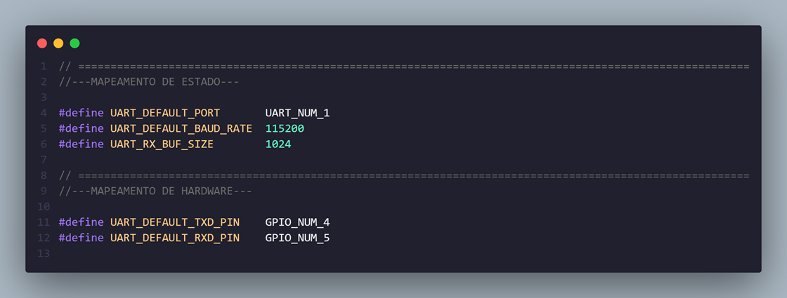
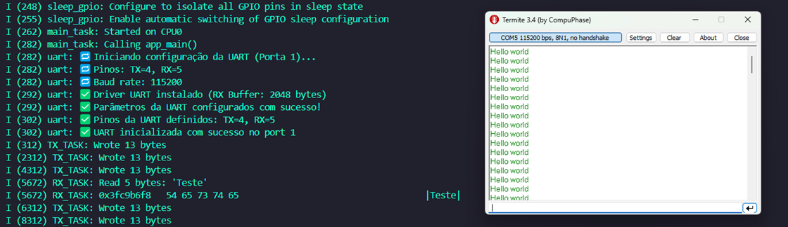

# _UART Pinout_

---

## Sumário

- [Histórico de Versão](#histórico-de-versão)
- [Resumo](#resumo)
- [Objetivo](#objetivo)
- [Links para estudos](#links-para-estudos)
- [Pinos do projeto eletrônico](#pinos-do-projeto-eletrônico)
- [Bibliotecas](#bibliotecas)
- [Configuração do Firmware](#configuração-do-firmware)
- [Informações](#informações)

## Histórico de versão

| Versão | Data       | Autor         | Descrição          |
|--------|------------|---------------|--------------------|
| 1.0.0  | 01/04/2025 | Adenilton R   | Inicio do projeto  |

---

## Resumo

Este projeto implementa uma comunicação serial assíncrona (UART) entre dois dispositivos ESP32-S3 utilizando pinos GPIO. As principais características incluem:

- Comunicação full-duplex via UART
- Tarefas separadas para transmissão e recepção
- Buffer de recepção de 1024 bytes
- Logs detalhados via interface serial
- Configuração flexível de pinos e baud rate

## Objetivo

Implementar uma comunicação UART robusta entre dispositivos ESP32 com:

1. **Configuração flexível**:
   - Seleção de pinos TX/RX
   - Ajuste de baud rate
   - Porta UART configurável

2. **Operação assíncrona**:
   - Tarefas independentes para TX e RX
   - Priorização da recepção de dados

3. **Monitoramento**:
   - Logs detalhados de inicialização
   - Hexdump dos dados recebidos
   - Contagem de bytes transmitidos/recebidos

## Links para estudos

[**Documentação UART ESP-IDF**](https://docs.espressif.com/projects/esp-idf/en/latest/esp32s3/api-reference/peripherals/uart.html)

[**Exemplos oficiais de UART**](https://github.com/espressif/esp-idf/tree/master/examples/peripherals/uart)

[**Protocolo UART**](https://pt.wikipedia.org/wiki/UART)

## Pinos do projeto eletrônico

| Função | Pino ESP32 | Descrição            |
|--------|------------|----------------------|
| TX     | GPIO4      | Transmissão de dados |
| RX     | GPIO5      | Recepção de dados    |
| GND    | GND        | Aterramento comum    |

## Bibliotecas

[main.c]()

[uart.c]()

[uart.h]()

[CMakeLists.txt]()

## Configuração do Firmware

O uart é configurado com os seguintes parâmetros no arquivo `uart.h`:

Dados do monitor serial:

## Informações

| Info        | Modelo           |
|-------------|------------------|
| uC          | ESP32-S3         |
| Placa       | ESP32-S3 Module  |
| Arquitetura | Xtensa / RISC    |
| IDE         | IDF v5.4.0       |