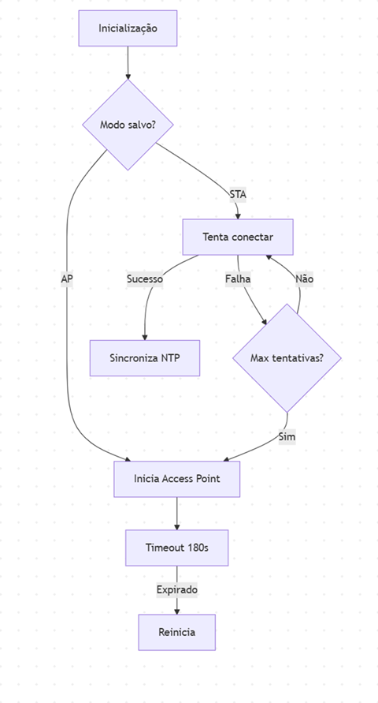
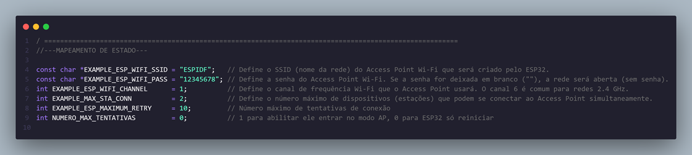

# _Wi-Fi Manager_


---

## Sumário

- [Histórico de Versão](#histórico-de-versão)
- [Resumo](#resumo)
- [Objetivo](#objetivo)
- [Links para estudos](#links-para-estudos)
- [Pinos do projeto eletrônico](#pinos-do-projeto-eletrônico)
- [Bibliotecas](#bibliotecas)
- [Configuração do Firmware](#configuração-do-firmware)
- [Informações](#informações)


## Histórico de versão

| Versão | Data       | Autor         | Descrição          |
|--------|------------|---------------|--------------------|
| 1.0.0  | 17/03/2025 | Adenilton R   | Inicio do projeto  |

---

## Resumo

Este projeto implementa um **Wi-Fi Manager** completo para ESP32, com capacidade de alternar entre:
- Modo **Access Point (AP)**: Para configuração via interface web
- Modo **Station (STA)**: Para conexão a redes Wi-Fi existentes

**Principais características:**

- Interface web para configuração (Captive Portal)
- Armazenamento seguro de credenciais em NVS
- Sincronização de horário via NTP
- Sistema de timeout automático
- Botão físico para ativação do modo AP

## Objetivo

**1. Gerenciamento de Conexão**
- **Modo AP**:
  - SSID: `ESP-IDF`
  - Senha: `12345678`
  - Interface web em `http://192.168.4.1`
  - Captive Portal Detection (Android/iOS/Windows)

- **Modo STA**:
  - Conexão automática às redes salvas
  - Tentativas de reconexão (máx. 10 tentativas)
  - Sincronização de horário via NTP

**2. Armazenamento**
- Credenciais Wi-Fi salvas na NVS
- Estado do modo (AP/STA) persistente

**3. Segurança**
- Autenticação WPA2/WPA3
- Reset seguro após timeout (180s padrão)

## Fluxograma



## Links para estudos

[**Documentação ESP-IDF**](https://docs.espressif.com/projects/esp-idf/en/v5.4/esp32/index.html)

[**Exemplos Oficiais Wi-Fi**](https://github.com/espressif/esp-idf/tree/v5.4/examples/wifi)

[**Protocolo NTP**](https://pt.wikipedia.org/wiki/Network_Time_Protocol)

## Pinos do projeto eletrônico

| Função          | Pino ESP32 |
|-----------------|------------|
| Botão Modo AP   | GPIO_NUM_0 |

## Bibliotecas

[main.c](https://github.com/AdeniltonR/Firmware-para-IDF-Espressif/blob/main/ESP-IDF/wifi-manager/main/main.c)

[Kconfig.projbuild](https://github.com/AdeniltonR/Firmware-para-IDF-Espressif/blob/main/ESP-IDF/wifi-manager/main/Kconfig.projbuild)

[wifi.c](https://github.com/AdeniltonR/Firmware-para-IDF-Espressif/blob/main/ESP-IDF/wifi-manager/components/wifi/wifi.c)

[wifi.h](https://github.com/AdeniltonR/Firmware-para-IDF-Espressif/blob/main/ESP-IDF/wifi-manager/components/wifi/include/wifi.h)

[CMakeLists.txt](https://github.com/AdeniltonR/Firmware-para-IDF-Espressif/blob/main/ESP-IDF/wifi-manager/components/wifi/CMakeLists.txt)

[wifi_manager.c](https://github.com/AdeniltonR/Firmware-para-IDF-Espressif/blob/main/ESP-IDF/wifi-manager/components/wifi_manager/wifi_manager.c)

[wifi_manager.h](https://github.com/AdeniltonR/Firmware-para-IDF-Espressif/blob/main/ESP-IDF/wifi-manager/components/wifi_manager/include/wifi_manager.h)

[CMakeLists.txt](https://github.com/AdeniltonR/Firmware-para-IDF-Espressif/blob/main/ESP-IDF/wifi-manager/components/wifi_manager/CMakeLists.txt)

[access_point.c](https://github.com/AdeniltonR/Firmware-para-IDF-Espressif/blob/main/ESP-IDF/wifi-manager/components/access_point/access_point.c)

[access_point.h](https://github.com/AdeniltonR/Firmware-para-IDF-Espressif/blob/main/ESP-IDF/wifi-manager/components/access_point/include/access_point.h)

[CMakeLists.txt](https://github.com/AdeniltonR/Firmware-para-IDF-Espressif/blob/main/ESP-IDF/wifi-manager/components/access_point/CMakeLists.txt)

[html.c](https://github.com/AdeniltonR/Firmware-para-IDF-Espressif/blob/main/ESP-IDF/wifi-manager/components/html/html.c)

[html.h](https://github.com/AdeniltonR/Firmware-para-IDF-Espressif/blob/main/ESP-IDF/wifi-manager/components/html/include/html.h)

[CMakeLists.txt](https://github.com/AdeniltonR/Firmware-para-IDF-Espressif/blob/main/ESP-IDF/wifi-manager/components/html/CMakeLists.txt)

## Configuração do Firmware

**Parâmetros Ajustáveis:**



**Estrutura do Projeto:**

```c
components/
├── wifi_manager/          # Lógica central
│   ├── include/
│   │   └── wifi_manager.h
│   └── wifi_manager.c
├── access_point/          # Modo AP
│   ├── include/
│   │   └── access_point.h  
│   └── access_point.c
├── wifi/                  # Modo STA
│   ├── include/
│   │   └── wifi.h
│   └── wifi.c
└── html/                  # Interface Web
    ├── include/
    │   └── html.h
    └── html.c
```

**Como Usar:**

1. **Primeira inicialização**:
    - O ESP32 inicia em modo AP
    - Conecte-se à rede `ESP-IDF`
    - Acesse `http://192.168.4.1`
    - Insira as credenciais da sua rede Wi-Fi
2. **Conexão automática**:
    - Após configuração, o ESP32 reinicia em modo STA
    - Conecta-se automaticamente à rede salva
3. **Forçar modo AP**:
    - Pressione o botão GPIO0 por 1 segundo
    - Útil para reconfiguração

Importande adicionar o arquivo dentro da pasta main [Kconfig.projbuild](https://github.com/AdeniltonR/Firmware-para-IDF-Espressif/blob/main/ESP-IDF/wifi-manager/main/Kconfig.projbuild):

Página web:


## Informações

| Info        | Modelo        |
|-------------|---------------|
| uC          | ESP32 32D     |
| Placa       | ESP32 Module  |
| Arquitetura | Xtensa / RISC |
| IDE         | IDF v5.4.0    |