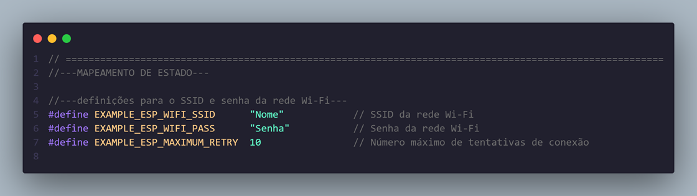
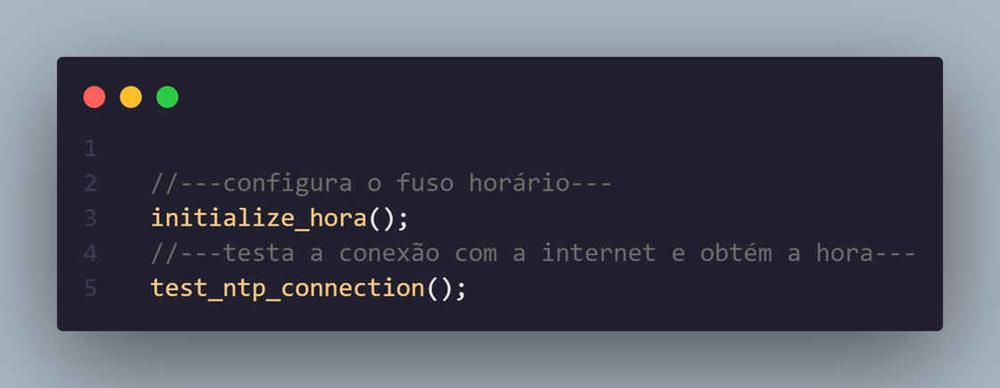

# _Wi-Fi Manager_


---

## Sumário

- [Histórico de Versão](#histórico-de-versão)
- [Resumo](#resumo)
- [Objetivo](#objetivo)
- [Links para estudos](#links-para-estudos)
- [Pinos do projeto eletrônico](#pinos-do-projeto-eletrônico)
- [Bibliotecas](#bibliotecas)
- [Configuração do Firmware](#configuração-do-firmware)
- [Informações](#informações)


## Histórico de versão

| Versão | Data       | Autor         | Descrição          |
|--------|------------|---------------|--------------------|
| 1.0.0  | 17/03/2025 | Adenilton R   | Inicio do projeto  |

---

## Resumo

Este projeto tem como objetivo configurar o ESP32 para se conectar a uma rede Wi-Fi manualmente, testar a conexão com a internet e sincronizar o horário usando o protocolo NTP (Network Time Protocol). O ESP32 atua como um dispositivo cliente (STA) que se conecta a um Access Point (AP) com SSID e senha pré-definidos.

O projeto utiliza o framework ESP-IDF e inclui funcionalidades como:

- Conexão manual a uma rede Wi-Fi.
- Teste de conexão com a internet.
- Sincronização de horário usando NTP.
- Configuração de fuso horário.

## Objetivo

O objetivo principal deste projeto é demonstrar como configurar o ESP32 para se conectar a uma rede Wi-Fi, testar a conexão com a internet e sincronizar o horário. Os objetivos específicos incluem:

1. **Configuração do Wi-Fi**:
    - Configurar o ESP32 para se conectar a uma rede Wi-Fi com SSID e senha personalizados.
    - Implementar tentativas de reconexão em caso de falha.
2. **Teste de Conexão com a Internet**:
    - Verificar se o ESP32 está conectado à internet.
    - Sincronizar o horário usando o protocolo NTP.
3. **Configuração de Fuso Horário**:
    - Configurar o fuso horário para Brasília (BRT/BRST).
4. **Obtenção de Horário**:
    - Obter e exibir a hora atual sincronizada com o servidor NTP.

## Links para estudos

[**ESP-IDF Documentation**](https://docs.espressif.com/projects/esp-idf/en/latest/esp32/index.html)

[**ESP32 Wi-Fi Example**](https://github.com/espressif/esp-idf/tree/master/examples/wifi)

[**NTP Protocol**](https://en.wikipedia.org/wiki/Network_Time_Protocol)

## Pinos do projeto eletrônico

Este projeto não utiliza pinos específicos do ESP32, pois foca na configuração de Wi-Fi e sincronização de horário.

## Bibliotecas

[main.c](https://github.com/AdeniltonR/Firmware-para-IDF-Espressif/blob/main/ESP-IDF/wifi/main/main.c)

[wifi.c](https://github.com/AdeniltonR/Firmware-para-IDF-Espressif/blob/main/ESP-IDF/wifi/components/wifi/wifi.c)

[wifi.h](https://github.com/AdeniltonR/Firmware-para-IDF-Espressif/blob/main/ESP-IDF/wifi/components/wifi/include/wifi.h)

[CMakeLists.txt](https://github.com/AdeniltonR/Firmware-para-IDF-Espressif/blob/main/ESP-IDF/wifi/components/wifi/CMakeLists.txt)

[Kconfig.projbuild](https://github.com/AdeniltonR/Firmware-para-IDF-Espressif/blob/main/ESP-IDF/wifi/main/Kconfig.projbuild)

## Configuração do Firmware

O Wi-Fi é configurado com os seguintes parâmetros no arquivo `wifi.c`:



Para poder testar a conexão de internet pode chamar as funções para puxar hora e data, as funções estão no arquivo `wifi.c`:



Configura o fuso horário:

```c
initialize_hora();
```

Testa a conexão com a internet e obtém a hora:

```c
test_ntp_connection();
```

Dados do monitor serial:


Importande adicionar o arquivo dentro da pasta main [Kconfig.projbuild](https://github.com/AdeniltonR/Firmware-para-IDF-Espressif/blob/main/ESP-IDF/wifi/main/Kconfig.projbuild):

## Informações

| Info        | Modelo        |
|-------------|---------------|
| uC          | ESP32 32D     |
| Placa       | ESP32 Module  |
| Arquitetura | Xtensa / RISC |
| IDE         | IDF v5.4.0    |