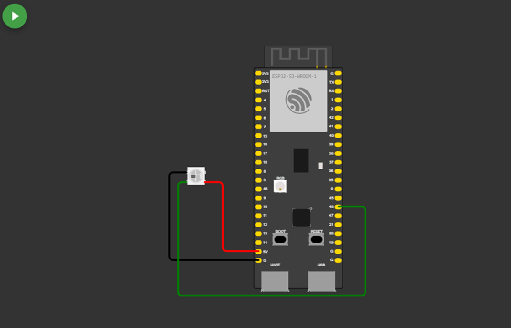
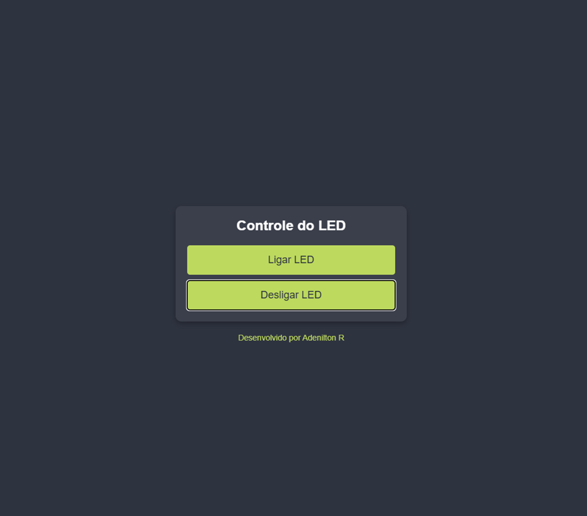
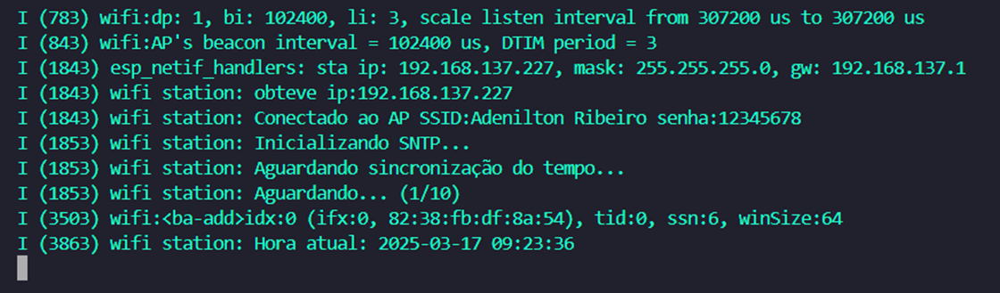
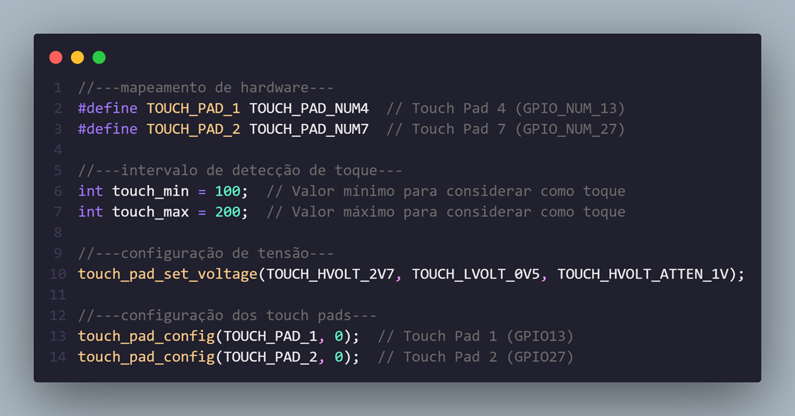
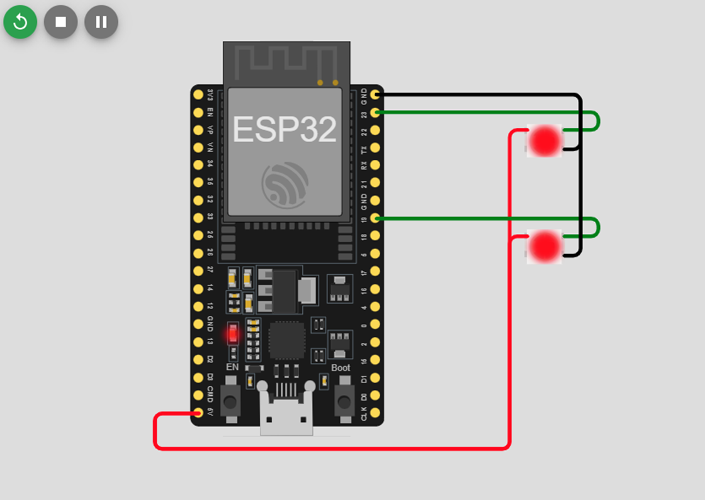

# _Projetos_


---

## Sumário

- [Histórico de Versão](#histórico-de-versão)
- [Boas Práticas para Commits](#boas-práticas-para-commits)
- [Resumo](#resumo)
    - [Exemplo do main para ESP-IDF](#exemplo-do-main-para-esp-idf)
    - [Arquivo .gitignore](#arquivo-.gitignore)
    - [Wi-Fi Manager](#wi-fi-manager)
    - [RGB-Ws2812B](#rgb-ws2812b)
    - [Emonlib](#emonlib)
    - [Access Point com ESP32](#access-point-com-esp32)
    - [WiFi](#wifi)
    - [DFPlayer Mini](#dfplayer-mini)
    - [Touch Pad](#touch-pad)
    - [Led Strip](#led-strip)

## Histórico de Versão

| Versão | Data       | Autor        | Descrição               |
|--------|------------|--------------|-------------------------|
| 1.0.0  | 29/08/2024 | Adenilton R  | Início do Projeto       |
| 1.0.0  | 17/03/2025 | Adenilton R  | Wi-Fi Manager           |
| 1.0.0  | 18/03/2025 | Adenilton R  | RGB-Ws2812B             |
| 1.0.0  | 11/03/2025 | Adenilton R  | Emonlib                 |
| 1.0.0  | 13/03/2025 | Adenilton R  | Access Point com ESP32  |
| 1.0.0  | 16/03/2025 | Adenilton R  | Wi-FI Manual            |
| 1.0.0  | 19/03/2025 | Adenilton R  | DFPlayer Mini           |
| 1.0.0  | 19/03/2025 | Adenilton R  | Touch Pad               |
| 1.0.0  | 20/03/2025 | Adenilton R  | Led Strip               |

---

## Boas Práticas para Commits

Para manter um histórico de commits organizado, siga as seguintes diretrizes:

- `feat:` (novo recurso para o usuário, não uma nova funcionalidade para script de construção)
- `fix:` (correção de bug para o usuário, não uma correção para um script de construção)
- `docs:` (alterações na documentação)
- `style:` (formatação, falta de ponto e vírgula, etc; nenhuma alteração no código de produção)
- `refactor:` (refatoração do código de produção, por exemplo, renomeação de uma variável)
- `test:` (adicionando testes ausentes, refatorando testes; sem alteração no código de produção)
- `chore:` (atualizando tarefas pesadas, etc; nenhuma alteração no código de produção)

---

## Resumo

Este conjunto de exemplos de firmware foi desenvolvido para facilitar a utilização e aprendizado na Espressif IDF. Os códigos incluem funcionalidades básicas e avançadas, abrangendo diferentes aplicações práticas, como controle de dispositivos, leitura de sensores e comunicação entre módulos.

### Exemplo do main para ESP-IDF

```c
/*
 * NOME: Nome
 * DATA: 31/01/2025
 * PROJETO: Nome do projeto
 * VERSAO: 1.0.0
 * DESCRICAO: - feat: Descrição.
 *            - docs: ESP32-32D - ESP-IDF v5.4.0 e Simulador PICSimLab 0.9.1
 * LINKS: 
*/

// ========================================================================================================
//---BIBLIOTECAS---

#include <stdio.h>
#include "freertos/FreeRTOS.h"
#include "freertos/task.h"
#include "esp_system.h"

// ========================================================================================================
//---MAPEAMENTO DE ESTADO---

// ========================================================================================================
//---MAPEAMENTO DE HARDWARE---

// ========================================================================================================
//---VARIAVEIS GLOBAIS---

// ========================================================================================================
//---PROTOTIPO DA FUNCAO---

// ========================================================================================================
/**
 * @brief Void main
 *
 */
void app_main(void) {

    while(1) {
        //...
    }
}
```

### Arquivo .gitignore

[.gitignore](Docs/)

### Wi-Fi Manager

Para obter mais informações sobre o projeto, clique no __[**link**](https://github.com/AdeniltonR/Firmware-para-IDF-Espressif/tree/main/Projetos/wifi_manager)__ a seguir.

`[Adicionar Imagen ou Gif…]`

### RGB-Ws2812B

Para obter mais informações sobre o projeto, clique no [**link**](https://github.com/AdeniltonR/Firmware-para-IDF-Espressif/tree/main/ESP-IDF/rgb-ws2812b) a seguir.



### Emonlib

Para obter mais informações sobre o projeto, clique no [**link**](https://github.com/AdeniltonR/Firmware-para-IDF-Espressif/tree/main/ESP-IDF/emonlib) a seguir.


### Access Point com ESP32

Para obter mais informações sobre o projeto, clique no [**link**](https://github.com/AdeniltonR/Firmware-para-IDF-Espressif/tree/main/ESP-IDF/access-point) a seguir.



### WiFi

Para obter mais informações sobre o projeto, clique no [**link**](https://github.com/AdeniltonR/Firmware-para-IDF-Espressif/tree/main/ESP-IDF/wifi) a seguir.



### DFPlayer Mini

Para obter mais informações sobre o projeto, clique no [**link**](https://github.com/AdeniltonR/Firmware-para-IDF-Espressif/tree/main/ESP-IDF/dfplayer-mini) a seguir.


### Touch Pad

Para obter mais informações sobre o projeto, clique no [**link**](https://github.com/AdeniltonR/Firmware-para-IDF-Espressif/tree/main/ESP-IDF/touch-pad) a seguir.



### Led Strip

Para obter mais informações sobre o projeto, clique no [**link**](https://github.com/AdeniltonR/Firmware-para-IDF-Espressif/tree/main/ESP-IDF/led-strip) a seguir.

